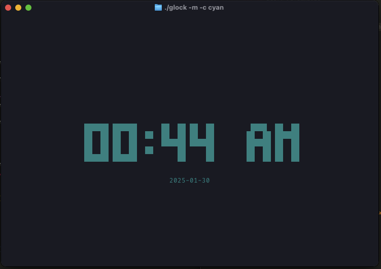

# glock: go clock

a digital clock in your terminal, inspired by tty-clock

> it's just my practice medium, hacking around CLI using go

## libs used:

- [cobra](https://github.com/spf13/cobra)
- [tcell](https://github.com/gdamore/tcell)

## sample image:

